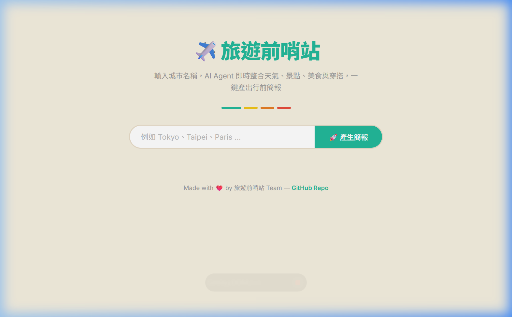
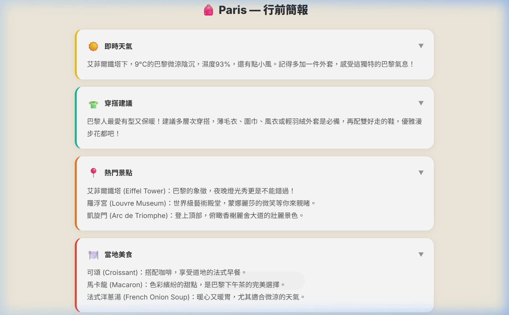

# AI agent 開發分組實作

> 課程：AI agent 開發 — Tool 與 Skill
> 主題： 旅遊前哨站

---

## Agent 功能總覽

> 這個 Agent 是一個「旅遊前哨站」，它可以協助使用者在出發前取得目的地的全方位資訊。使用者只需輸入想去的城市，我們的預處理 Tools 將抓取所有必要的 API，並交給 **Gemini 大模型** 進行在地化翻譯、潤飾與統整，最後於網頁端呈現一份流暢的中文行前簡報。

| 使用者輸入   | Agent 行為                             | 負責組員 |
| ------------ | -------------------------------------- | -------- |
| （例：天氣） | 呼叫 weather_tool，查詢即時天氣        |   陳柏宇 |
| （例：景點） | 呼叫 search_tool，搜尋熱門景點與美食   |   楊承軒   |
| （例：建議） | 呼叫 advice_tool，取得隨機旅行建議     |     陳婉榕     |
| （例：活動） | 呼叫 bored_tool，取得打發時間的活動    |     陳婉榕     |
| （例：知識） | 呼叫 trivia_tool，取得旅遊冷知識       |     林永富     |
| （大腦綜合） | 送入 Gemini 模型進行翻譯與在地化推薦   | 洪紹禎 |
| （前端顯示） | 透過 Flask API 渲染至專屬網頁介面      | 洪紹禎 |

---

## 組員與分工

| 姓名 | 負責功能           | 檔案                  | 使用的技術 / API                       |
| ---- | ----------------- | --------------------- | ------------------------------------ |
| 陳柏宇 | weather_tool      | `tools/weather_tool.py` | `wttr.in`                          |
| 楊承軒 | search_tool       | `tools/search_tool.py`  | DuckDuckGo Search API                |
| 陳婉榕 | bored/trivia/advice | `tools/*.py`          | Bored/UselessFacts/Advice API        |
| 洪紹禎 | Skill 整合 / AI    | `skills/trip_briefing.py`| Gemini 2.5 Flash (`langchain-google-genai`) |
| 洪紹禎 | Agent 後端與前端 UI| `main.py`, `templates/`| Flask + Vanilla HTML/CSS/JS          |

---

## 專案架構

```text
├── tools/
│   ├── instructions.md     # 給各小組成員的實作規範說明
│   ├── weather_tool.py
│   ├── search_tool.py
│   ├── bored_tool.py
│   ├── trivia_tool.py
│   └── advice_tool.py
├── skills/
│   └── trip_briefing.py    # 組合各個工具產出 JSON，並交給 Gemini 潤飾
├── templates/
│   └── index.html          # Web 前端介面（純 HTML/CSS/JS 實作質感介面）
├── main.py                 # Flask 後端應用程式與 API 端點
├── .env.sample             # Gemini API Key 環境變數範本
├── requirements.txt        # 專案相依套件清單 (flask, langchain, google-genai...)
└── README.md
```

---

## 使用方式

請開啟終端機，執行以下指令：

```bash
# 1. 建立並啟動虛擬環境 (Windows 請執行: .venv\Scripts\activate)
python -m venv .venv
source .venv/bin/activate

# 2. 安裝套件
pip install -r requirements.txt

# 3. 設定 API Key
# 請將 .env.sample 複製一份並重新命名為 .env，然後填寫你的 GEMINI_API_KEY
cp .env.sample .env

# 4. 執行 Web App
python main.py
```

> 🔔 啟動後，請開啟瀏覽器前往：`http://127.0.0.1:5000` 即可開始使用！

---

## 執行結果

> 實際的「旅遊前哨站」行前簡報生成畫面（結合了所有 API 工具、並由 Gemini 2.5 潤飾後端資料、且具備全新的前端質感設計）：

**網頁首頁介面**


**填入城市（如：Paris) 後產生的精美簡報卡片**


---

## 各功能說明

### 天氣查詢（負責：陳柏宇）

- **Tool 名稱**：weather_tool
- **使用 API**：`https://wttr.in/{city}?format=j1`
- **輸入**：城市名稱 `{city}`
- **輸出範例**：`{"temp_C": "25", "weatherDesc": "Clear"}`

```python
TOOL = {
    "name": "weather_tool",
    "description": "查詢目的地的即時天氣",
    "parameters": {
        "type": "object",
        "properties": {
            "city": {"type": "string", "description": "要查詢天氣的城市名稱"}
        },
        "required": ["city"]
    }
}
```

### 景點與美食搜尋（負責：楊承軒）

- **Tool 名稱**：search_tool
- **使用 API**：`duckduckgo-search` 套件
- **輸入**：搜尋關鍵字（例如 "{city} 景點", "{city} 必吃美食"）
- **輸出範例**：`[{ "title": "...", "href": "...", "body": "..." }]`

### 活動與建議（負責：陳婉榕）

- **Tool 名稱**：bored_tool / trivia_tool / advice_tool
- **使用 API**：Bored API, UselessFacts API, Advice Slip API
- **輸入**：無（或簡單參數）
- **輸出範例**：傳回字串或字典，例如：`"Learn how to write in shorthand. (類型: education)"`

### Skill：行前簡報整合（負責：洪紹禎）

- **組合了哪些 Tool**：`weather_tool`, `search_tool`, `bored_tool`, `trivia_tool`, `advice_tool`
- **執行順序**：

```
Step 1: 呼叫 weather_tool / search_tool / 其它額外 API 工具，取得原始資料（包含英文）。
Step 2: 將全部收集到的純文字/JSON 組合進 Prompt 中。
Step 3: 呼叫 Gemini 2.5 Flash 語言模型，要求模型擔任導遊，翻譯並將隨機資料在地化（例如隨機出現「參觀博物館」，Gemini 會包裝為「去羅浮宮走走」）。
Step 4: 規定 Gemini 輸出指定格式的 JSON 字典，供前端網頁逐區塊展開渲染。
```

---

## 心得

### 遇到最難的問題
- 陳婉榕：這次實作遇到最大的困難是部分 API 經常連線不穩，且原版的 trivia_tool 只會回傳與目的地毫無關聯的純英文無聊事實。為了解決這個問題，我修改了 trivia_tool 的底層邏輯，將其改為串接「中文維基百科 API」，並加入 redirects=1 參數來適應各種中英文城市輸入，成功提取出真正與當地旅遊相關的中文在地小常識。這不僅解決了語言障礙，也讓行前簡報的內容更有意義！
- 洪紹禎：我覺得最困難的部分是如何讓原先雜亂、語言不一的原始 API 資料，穩定且有結構地渲染到精美的前端畫面上。為此，我將原有的 Streamlit 捨棄，重構成 Flask + HTML/JS，並且在 `trip_briefing.py` (Skill) 導入 Gemini 大模型擔任大腦。處理 Prompt Engineering 時花了不小心力，尤其是要確保 LLM 絕對只輸出符合格式的 JSON 字串，以防前端解析崩潰，同時還要處理 API 憑證失效時的後備保護機制。
- 陳柏宇：這次最困難的部分是協作時要統一Tool的回傳格式與錯誤處理，確保整合時不會互相衝突最困難 


### Tool 和 Skill 的差別

- 陳婉榕：在我的理解中，**Tool（工具）** 像是基礎的零件，它是單一目的的獨立模組（例如單純只負責抓天氣、抓隨機一句格言、或者查網頁摘要），專注於完成特定的小任務；而 **Skill（技能）** 則是負責統籌的指揮中心，它具備更進階的流程邏輯，能將多個 Tool 的零散輸出有效地拼湊、組合起來，最終加工成符合使用者需求的完整服務（例如這次產出條理分明的 Markdown 行前簡報）。
- 洪紹禎：如果用機器人的比喻，Tool 就是機器的「感測器與手腳」，只能機械式地向外爬取與帶回生硬的資料；而 Skill 就是機器的「大腦處理中樞」。特別是在這次加上 Gemini 之後，Skill 把那些片段、沒溫度的資料，經過翻譯、在地化處理與消化後，變成有質感且像真人導遊給出的行前簡報。Skill 是賦予資料靈魂的關鍵。
- 陳柏宇：Tool是單一功能的API呼叫；Skill是組合多個Tool並整合輸出的高層邏輯
  
### 如果再加一個功能

- 陳婉榕：如果可以再加一個 Tool，我想加入**即時匯率換算工具 (currency_tool)**。因為既然這個 Agent 定位是「旅遊前哨站」，如果在取得目的地的同時，能夠自動查出目的地所屬的國家，並且自動提供台幣對當地貨幣的即時匯率（例如：去 Tokyo 就自動顯示 1 JPY = ? TWD），對於出發前準備估算旅費與兌換外幣會非常實用！
- 洪紹禎：我會想加入 **地圖預覽工具 (maps_tool)**。因為現在我們已經能透過 LLM 分析出精準的「在地美食與景點」清單，但使用者看到文字後還是得自己去 Google Maps 找。如果增加 map_tool，自動生成相對應的景點經緯度，或是嵌入一張該地標的靜態地圖，就能大幅提升視覺豐富度與路線規劃的實用性。
- 陳柏宇：想加匯率換算工具，讓旅客出發前就能掌握當地貨幣與預算規劃。
